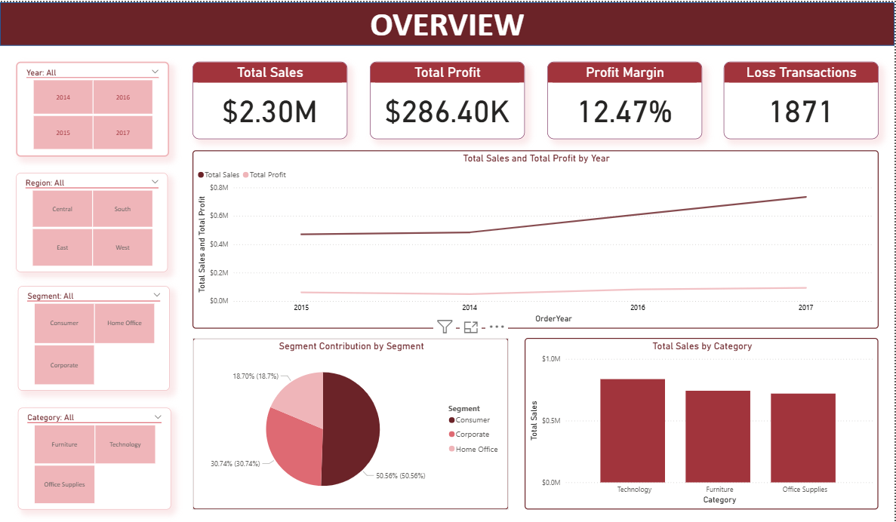
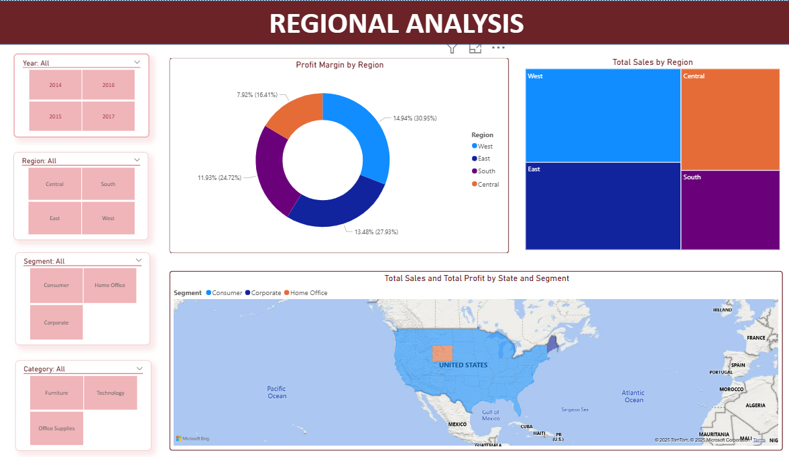
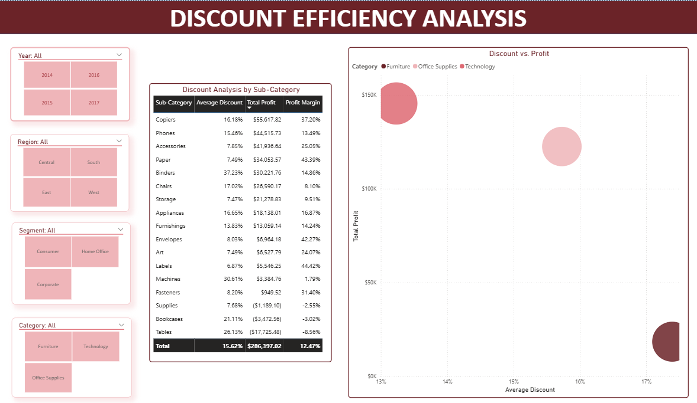

# Sales Performance Dashboard using Power BI

## 🎯 Project Overview
This project involved developing an interactive Sales Performance Dashboard using Power BI to analyze a comprehensive retail dataset (`Superstore.csv`). The primary goal was to transform raw sales data into actionable business insights, helping stakeholders understand sales trends, identify underperforming areas, and make data-driven decisions to navigate market competition and improve performance.

## 📊 Business Problem
The business faced challenges due to intense market competition and potential declining sales performance. Key business questions included:
- How has sales performance evolved over time (2014-2017)?
- Which products, categories, or customer segments are underperforming?
- What insights can be derived to address competitive challenges and improve overall sales?

## ✨ Features & Dashboard Highlights
-   **Interactive Visualizations:** Dynamic charts, graphs, and maps for exploring sales, profit, and discount across different dimensions.
-   **Sales Trend Analysis:** Track sales performance over years, quarters, and months.
-   **Category & Product Performance:** Identify top-performing and underperforming categories and products.
-   **Regional Sales Overview:** Visualize sales distribution and performance across various geographical regions.
-   **Customer Segmentation:** Analyze sales by customer segments to tailor marketing strategies.
-   **Key Performance Indicators (KPIs):** Display critical metrics like total sales, profit margin, and average discount.

## 🛠️ Tools & Technologies Used
-   **Power BI Desktop:** For data transformation (Power Query), data modeling (DAX), and dashboard creation.
-   **Microsoft Excel:** For initial data exploration and source data management (`Superstore.csv`).
-   **Data Analysis Concepts:** Applied for exploratory data analysis (EDA), trend identification, and deriving business recommendations.

## 🚀 Project Steps & Methodology
1.  **Data Acquisition & Cleaning:** Imported `Superstore.csv` into Power BI and used Power Query Editor to clean, transform, and prepare the data for analysis (e.g., handling missing values, correcting data types).
2.  **Data Modeling:** Established relationships between various tables (Orders, Returns, People, Products) to create a robust star schema data model.
3.  **DAX Measures Creation:** Developed several DAX (Data Analysis Expressions) formulas to calculate key metrics such as Total Sales, Total Profit, Profit Margin, Sales per Region, etc.
4.  **Dashboard Design:** Created multiple interactive dashboard pages, focusing on user experience and clarity, utilizing a variety of visualizations (bar charts, line graphs, pie charts, scatter plots, maps).
5.  **Insight Generation:** Analyzed the visualized data to identify patterns, trends, and anomalies, providing answers to the initial business questions.
6.  **Reporting:** Compiled a comprehensive report (5-7 slides) summarizing key findings, actionable insights, and strategic recommendations for improving sales performance.

## 📈 Key Findings & Recommendations

**Finding 1:** The total sales reached **USD 2.3 million** with strong growth over the years; however, the total profit was only **USD 286.43K** with an average profit margin of **12.47%**, and there were **1,871 loss-making transactions**, indicating that operational costs have not been fully optimized.  
**Recommendation 1:** Reassess operational expenses and overall efficiency, focusing on reducing loss-making transactions through detailed cost analysis by category and region.

**Finding 2:** The **Technology** category leads in both revenue and stable profitability (with **Copiers, Phones, and Accessories** contributing the most), achieving the highest profit margin in the **Central** region (**28.78%**). In contrast, **Furniture** shows high revenue but low and volatile profitability, especially in Central (**only 1.46%**).  
**Recommendation 2:** Strengthen investment in the Technology segment by expanding product offerings and online sales, while reviewing cost structures, inventory management, and pricing strategies for Furniture to improve profit margins — prioritizing underperforming regions such as **Central** and **South**.

**Finding 3:** The **Consumer** segment accounts for **50.56%** of total sales but has been declining from 2015 to 2017, while **Home Office** contributes **18.7%** yet shows steady sales growth. The **West** region leads (with **30.95%** of sales and **14.94%** profit margin), whereas **Central** performs the worst (**16.41%** of sales, **7.92%** profit margin).  
**Recommendation 3:** Enhance marketing and customer engagement efforts for the Consumer segment to reverse the downward trend, while investing long-term in Home Office. Diversify product portfolios in the **West** and **East** regions, and implement targeted marketing campaigns as well as cost optimization strategies in the **South** and **Central** regions to boost regional performance.

## 🖼️ Dashboard Screenshots
### Dashboard Overview

### Detailed Sales & Profit Analysis

### Regional Analysis

### Discount Efficiency Analysis

